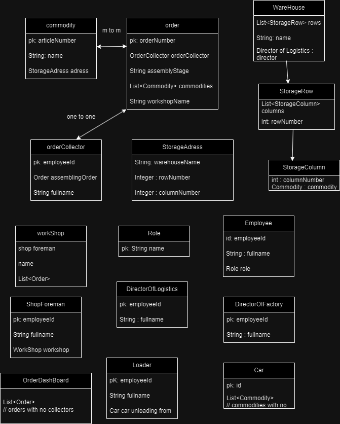

Приложение завод

Бизнес задачи 

	Должности
	1 - Директор логистики
	2 - Работник склада
	3 - Бригадир цеха
	4 - Директор завода

	1) Директор логистики - управляет работниками склада,
    делает заказ у других заводов на сырье, которое привезут на фуре,
    машине, которую в последствиии будет разгружать грузчик

	2) Работник склада 
		Комплектовщик - принимает заказ на товары, собирает его, затем отправляет в цех
		Грузчик - принимает машину с товаром и расставляет товар на свободные места в складе
	

	3) Бригадир цеха - заказывает сырье из доступного на складе

	4) Директор завода - контроль всех работников

Технические Требования 

	1. Авторизация
	2. База данных
	3. Тесты
	4. Rest API завода

Технологии 

	Lombok
	Hibernate
	PostgreSQL
	Spring Security
	Spring Boot
	Spring Web
	Junit 5
	AssertJ
	Mockito
	Gradle

